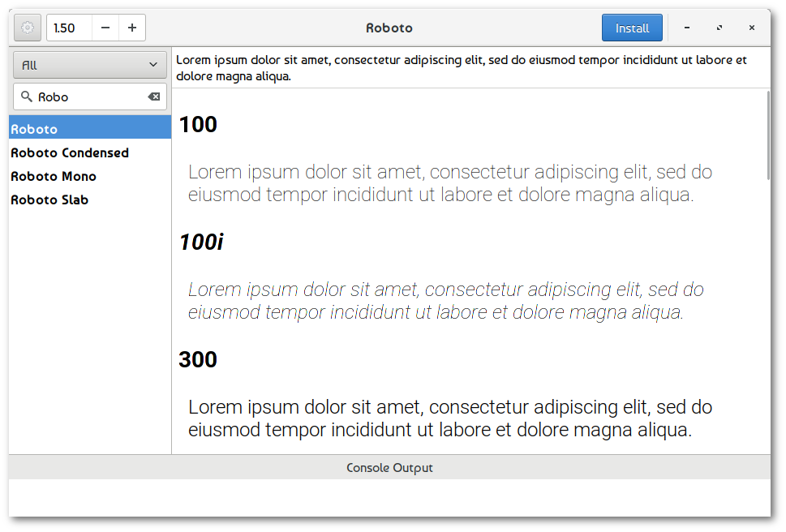
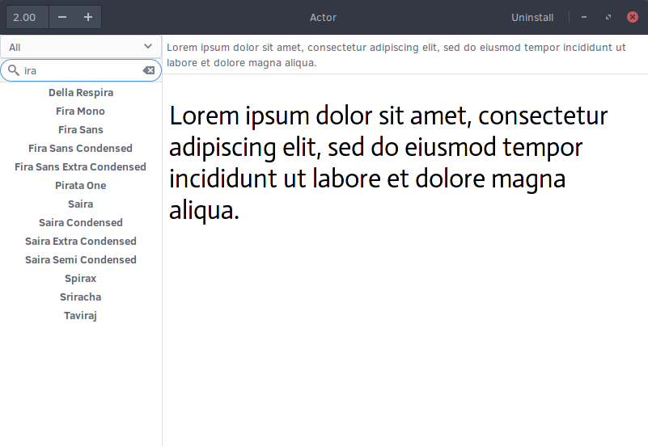
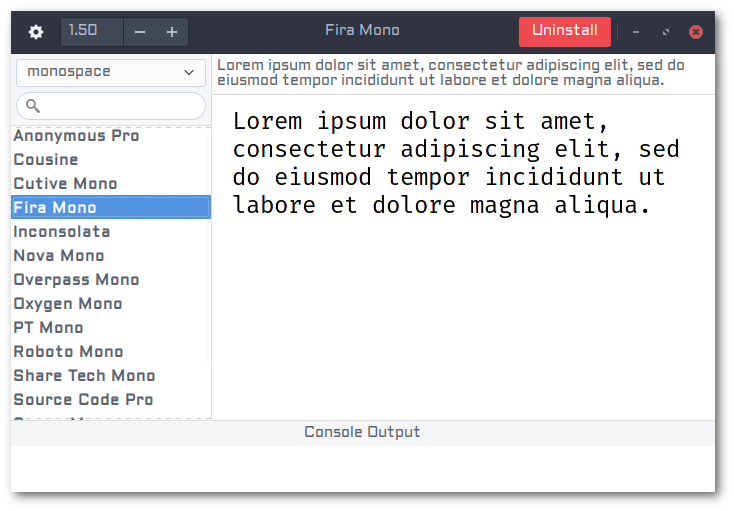

# Font Finder

This project is a from-scratch implementation of [TypeCatcher](https://github.com/andrewsomething/typecatcher/) in Rust. It is a GTK3 application for browsing through and installing fonts from [Google's font archive](https://fonts.google.com/) from the comfort of your Linux desktop.

## Installation Instructions

```
make
sudo make install prefix=/usr/local
```

## Requirements

- cargo (Rust 1.24.0)
- libwebkit2gtk-4.0-dev
- libgtk-3-dev

## Screenshots

### Filtering w/ Search



### Filtering w/ Category



### Multiple Paragraphs



### Dark Preview


## Translators

Translators are welcome to submit translations directly as a pull request to this project. It is generally expected that your pull requests will contain a single commit for each language that was added or improved, using a syntax like so:

```
i18n(eo): Add Esperanto language support
```

```
i18n(pl): Improvements to Polish language support
```

Translation files for the GTK application can be found [here](./gtk/i18n/) and [here](./i18n/). We are using [Project Fluent](https://projectfluent.org) for our translations, which should be easier than working with gettext.

### Supported Languages

- [English](./gtk/i18n/en/)
- [Polish](./gtk/i18n/pl/)